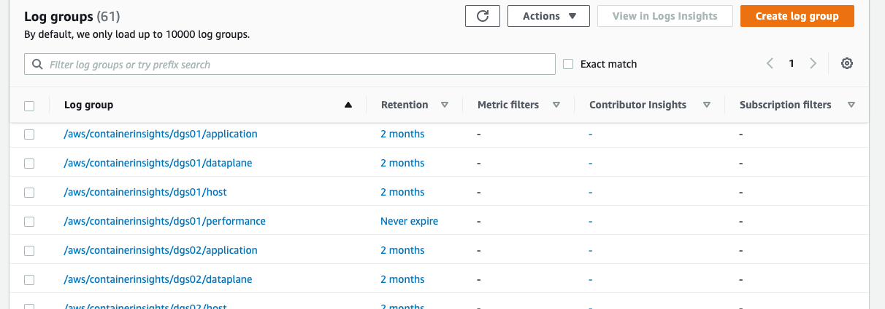
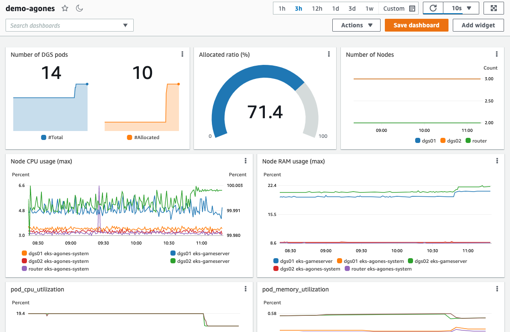
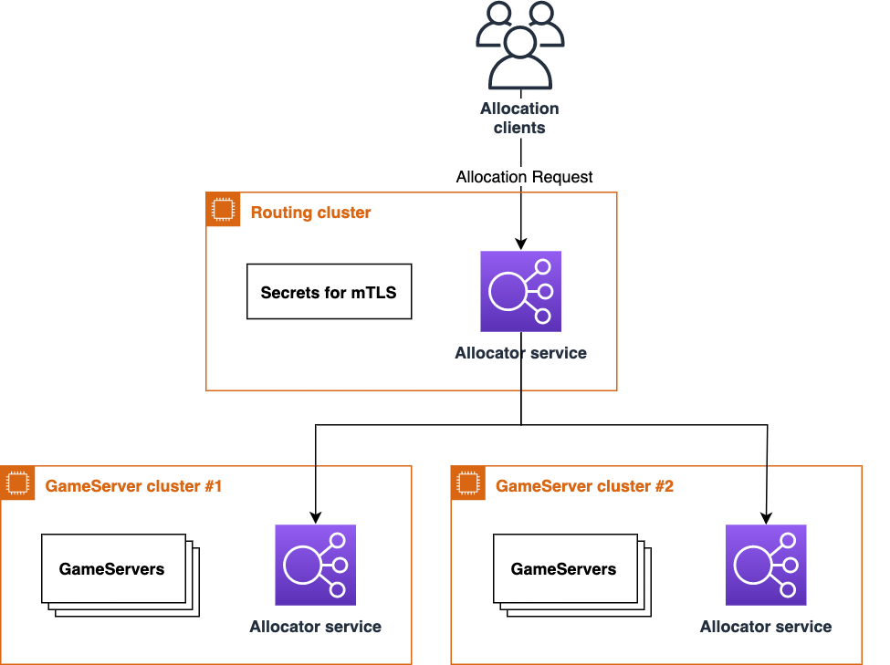

# Multi-cluster allocation demo for Agones on EKS
This sample deploys [Agones](https://agones.dev/site/) multi-cluster configuration to Amazon EKS, one routing cluster and two DGS clusters, with [multi-cluster allocation feature](https://agones.dev/site/docs/advanced/multi-cluster-allocation/) enabled.

This sample also works as a good Terraform example for the following features:

* Deploy Agones with Network Load Balancer (NLB) instead of Classic Load Balancer with [AWS Load Balancer Controller](https://kubernetes-sigs.github.io/aws-load-balancer-controller/)
* Aggregate logs and metrics into Amazon CloudWatch using [Fluent Bit](https://fluentbit.io/) and [OpenTelemetry](https://aws-otel.github.io/)
* View Kubernetes resources with [Kubernetes Dashboard](https://github.com/kubernetes/dashboard)
* Adjust the number of nodes by [Cluster Autoscaler](https://github.com/kubernetes/autoscaler/blob/master/cluster-autoscaler/cloudprovider/aws/README.md)

## Steps to Deploy
### Prerequisites
You must install the following tools before deploying this sample:

* [Terraform CLI](https://learn.hashicorp.com/tutorials/terraform/install-cli)
* [Kubectl](https://kubernetes.io/docs/tasks/tools/)
* [Helm](https://helm.sh/docs/intro/install/)
* [AWS CLI](https://docs.aws.amazon.com/cli/latest/userguide/getting-started-install.html)
  * After install, you must configure permission equivalent to Administrator IAM policy

### Check Terraform parameters
Please open [`variable.tf`](./variable.tf) and check the parameters.

You can continue to deploy without any modification, but you may want to change AWS region to deploy.
You can also strengthen your security by setting allowed CIDRs, but at least all the public interfaces are protected by authN/Z.

### Deploy
You can deploy this sample by running the following commands:

```sh
# Install required modules
terraform init

# deploy to your account
terraform apply -auto-approve
```

It usually takes 20-30 minutes to deploy.

After it finishes, please check all the pods are running properly (i.e. `Running` state) by the following commands:

```sh
aws eks update-kubeconfig --name dgs01
kubectl get pods -A

aws eks update-kubeconfig --name dgs02
kubectl get pods -A

aws eks update-kubeconfig --name router
kubectl get pods -A
```

## Usage
### Connect to a game server
You can just follow [the official guide](https://agones.dev/site/docs/getting-started/create-gameserver/#2-fetch-the-gameserver-status) to connect to a game server.

```sh
aws eks update-kubeconfig --name dgs01 # or --name dgs02
kubectl get gs

# you will get a output like below
NAME                    STATE          ADDRESS                                          PORT   NODE                                        AGE
dgs-fleet-2l7fs-8pjfb   Ready          ec2-<redacted>.us-west-2.compute.amazonaws.com   7684   ip-10-0-177-35.us-west-2.compute.internal   66m
dgs-fleet-2l7fs-dtz7c   Ready          ec2-<redacted>.us-west-2.compute.amazonaws.com   7039   ip-10-0-177-35.us-west-2.compute.internal   66m

# get IP address and PORT number from the above output
nc -u {IP} {PORT}

# now you can send some message and see ACK is returned
```

As a sample game server, we are running [simple-game-server](https://github.com/googleforgames/agones/tree/main/examples/simple-game-server). You can check the available commands in the document.

### Allocate a game server
You can allocate a game server pod either by using [`GameServerAllocation` API aggregation](https://agones.dev/site/docs/reference/gameserverallocation/) or [allocator service client](https://agones.dev/site/docs/advanced/multi-cluster-allocation/#allocate-multi-cluster).

To use GameServerAllocation API, run the following command:

```sh
aws eks update-kubeconfig --name router
kubectl create -f example/allocation.yaml
# Try to run above command several times 

# You can see some DGS pods are allocated
aws eks update-kubeconfig --name dgs01
kubectl get gs

aws eks update-kubeconfig --name dgs02
kubectl get gs
```

To use allocator service client, run the following command below. You can either use gRPC or REST interface.

```sh
NAMESPACE=default # replace with any namespace
EXTERNAL_IP=$(terraform output -raw allocation_service_hostname)
KEY_FILE=client.key
CERT_FILE=client.crt
TLS_CA_FILE=ca.crt

# get certificates locally
terraform output -raw allocation_service_client_tls_key | base64 -d > $KEY_FILE
terraform output -raw allocation_service_client_tls_crt | base64 -d > $CERT_FILE
terraform output -raw allocation_service_server_tls_crt | base64 -d > $TLS_CA_FILE

mv $KEY_FILE $CERT_FILE $TLS_CA_FILE ./example
cd ./example

# Using go example code for gRPC interface
go run allocation-client.go --ip ${EXTERNAL_IP} --namespace ${NAMESPACE} --key ${KEY_FILE} --cert ${CERT_FILE} --cacert ${TLS_CA_FILE} --multicluster true

# Using curl for REST interface
curl --key ${KEY_FILE} \
     --cert ${CERT_FILE} \
     --cacert ${TLS_CA_FILE} \
     -H "Content-Type: application/json" \
     --data '{"namespace":"'${NAMESPACE}'", "multiClusterSetting":{"enabled":true}}' \
     https://${EXTERNAL_IP}/gameserverallocation \
     -X POST -v 
```

Note that the allocation request is forwarded from routing cluster to DGS clusters with Agones multi-cluster allocation feature.

### Open Kubernetes Dashboard
You can open Kubernetes dashboard to see and manage Kubernetes resources in detail.
It is already installed in all the clusters. You can follow the steps below to open and login it.

```sh
aws eks update-kubeconfig --name <cluster name> # cluster name: dgs01, dgs02, router
kubectl proxy
# Now, open http://localhost:8001/api/v1/namespaces/kubernetes-dashboard/services/https:kubernetes-dashboard:https/proxy/#/login

# Retrieve access token by the below command:
kubectl -n kubernetes-dashboard get secret $(kubectl -n kubernetes-dashboard get sa/admin-user -o jsonpath="{.secrets[0].name}") -o go-template="{{.data.token | base64decode}}"
```

### Monitor logs and metrics in CloudWatch
Because Agones logs and metrics are aggregated into CloudWatch in this sample, you can easily check them in [CloudWatch management console](https://console.aws.amazon.com/cloudwatch/home).

To check logs, you can open `Log groups` page, and open log groups named for example `/aws/containerinsights/dgs01/application`.



Here you can see application logs streamed nearly realtime fro a cluster by Fluent Bit. You can configure which logs are ingested and excluded by modifying [`modules/fluent_bit/manifests`](./modules/fluent_bit/manifests/fluent_bit.yaml). Please also check [the official document](https://docs.fluentbit.io/manual/administration/configuring-fluent-bit/classic-mode/configuration-file) for further detail.

To check metrics, you can either open `All metrics` page or `Dashboards` page from CloudWatch management console.
In All metrics page, you can check each metric one by one, which can be useful to check metrics in ad-hoc manner.

In CloudWatch Dashboards page, you can create a dashboard to monitor all the required metrics at a glance.
This sample includes a sample dashboard for monitoring Agones. You can import the dashboard by the following command:

```sh
aws cloudwatch put-dashboard --dashboard-name agones-demo-dashboard --dashboard-body file://exmaple/dashboard.json
```

Note that AWS region `us-west-2` is hard-coded in `dashboard.json`. If you deployed this sample in other regions, please replace it before creating dashboard.

After `put-dashboard` successed, now you can open the imported dashboard from CloudWatch management console.



You can freely and intuitively customize the dashboard via management console. Please also refer to [this document](https://docs.aws.amazon.com/AmazonCloudWatch/latest/monitoring/CloudWatch_Dashboards.html) if you need further information.

You can add or remove metrics ingested into CloudWatch by modifying [`otel.yaml`](./modules/aws_otel/manifests/otel.yaml). 
The main document for AWS Distro for OpenTelemetry [is here](https://aws-otel.github.io/docs/getting-started/collector).
You can also refer to the URLs commented in the file for further detail of each configs.  

### Add more DGS clusters
Currently there is only two DGS clusters but you can add them more.

To add a DGS cluster, open [`main.tf`](./main.tf) and add another `./modules/dgs_cluster` module. You also need to add the module to `local.dgs_clusters` list variable.

```tf
# Add this
module "dgs03" {
  source       = "./modules/dgs_cluster"
  cluster_name = "dgs03"
  vpc          = module.vpc

  cluster_endpoint_public_access_cidrs = var.cluster_endpoint_allowed_cidrs
  gameserver_allowed_cidrs             = var.gameserver_allowed_cidrs
}

# Don't forget to edit also this variable
locals {
  dgs_clusters = [module.dgs01, module.dgs02, module.dgs03]
}
```

## Architecture / How it works
The architecture overview of this sample is as the image below. 



We adopt a cluster topology of *Dedicated Cluster Responsible For Routing*, [which is disscussed here](https://github.com/googleforgames/agones/issues/597). By this way, your cluster configurations are symmetric - all the DGS clusters can share the same configuration, which is simpler than the toplogy *Single Cluster Responsible For Routing* with a special DGS cluster to perform serving game servers as well as allocation routing function. *All Clusters Responsible For Routing* topology seems overkill for a single region deployment, because it is unlikely for only a single cluster to fail while other clusters in the same region are working normally. It might improve availability with multi-region deployment though.

## Clean up
To avoid incurring future charges, clean up the resources you created.

You can remove all the AWS resources deployed by this sample running the following command:

```sh
terraform destroy -auto-approve
```

## Security

See [CONTRIBUTING](CONTRIBUTING.md#security-issue-notifications) for more information.

## License

This library is licensed under the MIT-0 License. See the LICENSE file.
